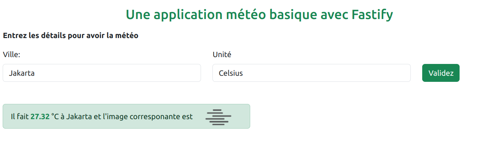

#### Meteo
Une application minimaliste pour récupérer le temps qu'il fait dans une ville

#### Installation
- Il suffit de cloner le projet: `git clone git@gitlab.com:benjaminAMOUZOU/meteo.git` ;
- Ensuite executez `npm install` pour installez les dépendances ;
- Enfin `node index.js` ou `nodemon index.js` pour exécuter le projet.

#### Outils
- Node.js 20 ;
- Ejs 3.1.9 (Moteur de template) ;
- Fastify 4.26.2 ;
- Nodemon 3.1.0 (Hot Reload) ;
- Fastify/formbody: 7.4.0 ;
- Fastify/view: 9.0.0 ;
- Axios 1.6.7 ;

#### Utilisation
- Renseignez la ville puis choisissez le type de temperature Celsius ou Kelvin.

#### Un apeçu

